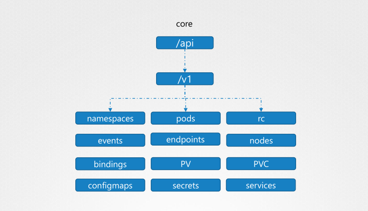
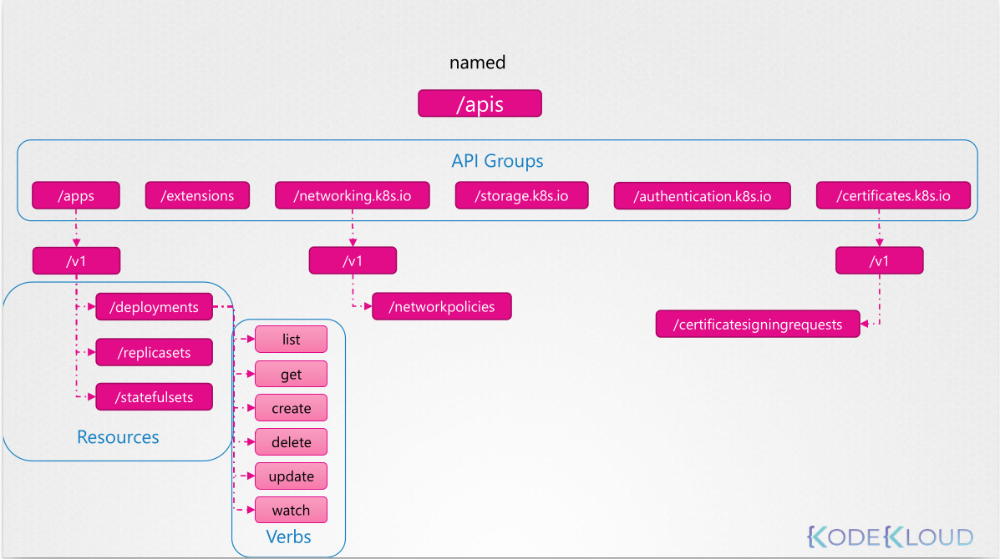

# API Groups

**Try this**

```sh
curl https://kube-master:6443/version

curl https://kube-master:6443/api/v1/pods
```

**This after 6443:**

`/metrics  /healthz  /version  /api  /apis /logs `

**API type**
### `Core`

### `Name`


```sh
curl http://localhost:6443 -k
curl http://localhost:6443/apis -k | grep “name”
```


