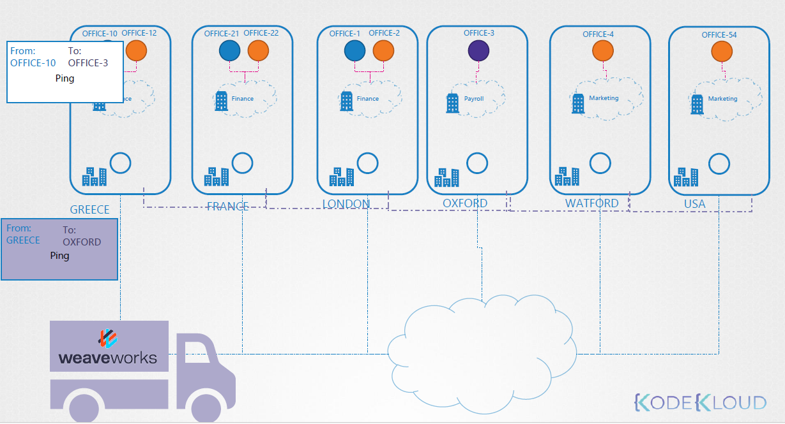

Pod is office 🏢  
Node is building 🏙️   
Network is office boy 👨‍💼  
LAN is the post office ☁️   
Route Table is Archive 📑 

```
When the Pod-1 🏢 in the Node-1 🏙️ want to sent data to pod-2 🏢 in the Node-2
The network 👨‍💼 will got to the LAN ☁️ and found the place for pod-2 🏢 in the route table 📑
```

## 🖼️ Ordinary Network


**But what if there is many Office in many cities?**    
it will be more Exhausting , So will use CNI (Wave) 
## 🖼️ Weave Network


`Before installing Weave Net, you should make sure the following ports are not blocked by your firewall: TCP 6783 and UDP 6783/6784`

```sh
kubectl apply -f https://github.com/weaveworks/weave/releases/download/v2.8.1/weave-daemonset-k8s.yaml
```