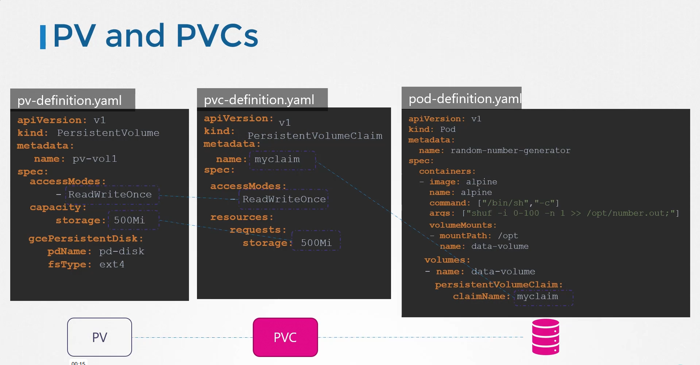
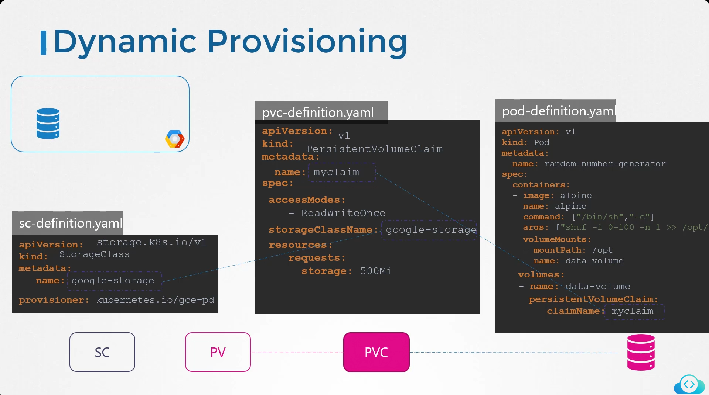

# [Volumes](https://kubernetes.io/docs/concepts/storage/volumes/) 

▶️ This data come from Conatainer ➡️ Pod ➡️ Node(only this node 💻 )

```yaml
apiVersion: v1
kind: Pod
metadata:
    name: random-number-generator
spec:
	containers:
	- image: alpine
		name: alpine
		command: ["/bin/sh","-c"]
		args: ["shuf -i 0-100 -n 1 >> /opt/number.out;"]
		volumeMounts:
		- mountPath: /opt # From the Container 
			name: data-volume  # To the Pod

	volumes:
	- name: data-volume # From the Pod
		hostPath:
			path: /data # To the Node
			type: Directory
```

## [Presistent Volumes (PV) :](https://kubernetes.io/docs/concepts/storage/persistent-volumes/)
``
 A persistent volume is a cluster wide pool of storage volumes configured by an administrator to be used by users deploying applications on the Cluster. 
``

``
 The admin create it 
``


---
`📁 pv-definition.yaml`
```yml
apiVersion: v1
kind: PersistentVolume
metadata:
	name: pv-vol1
spec: 
	accessModes:
		- ReadWriteOnce
	capacity:
		storage: 1Gi
	awsElasticBlockStore:
		volumeID: <volume-id>
		fsType: ext4
hostPath:
path: /tmp/data

```
```sh
kubectl create –f pv-definition.yaml

kubectl get persistentvolume
```
 
---
**type for access mode**
- ReadOnlyMany
- ReadWriteOnce
- ReadWriteMany
---
## [Presistent Volume Claim :](https://kubernetes.io/docs/concepts/storage/persistent-volumes/)
`The user create it to use
Every Presistent volume claim is bound to single presistent
`

when we create it 
it search for PV where is match by access mode and the capacity is allowed (and label)

`📁 pvc-definition.yaml`

```yml
apiVersion: v1
kind: PersistentVolumeClaim
metadata:
	name: myclaim
spec:
	accessModes:
		- ReadWriteOnce
	resources:
		requests:
			storage: 500Mi
```
```sh
kubectl create –f pvc-definition.yaml

#show PVCs
kubectl get persistentvolumeclaim

#Delete PVCs
kubectl delete persistentvolumeclaim myclaim
```
---
## Storage Class

We have to type 
1. Static Provisioning : 
   Pod ➡️ PVC ➡️ PV 
	 So every time we create PV we need to create PVC for it 



---
2. Dynamic Provisioning:
   
   Pod ➡️ PVC ➡️ SC

	 The different here , the SC is fixed , it go to the cloud and create the PV it need for the PVC


---
