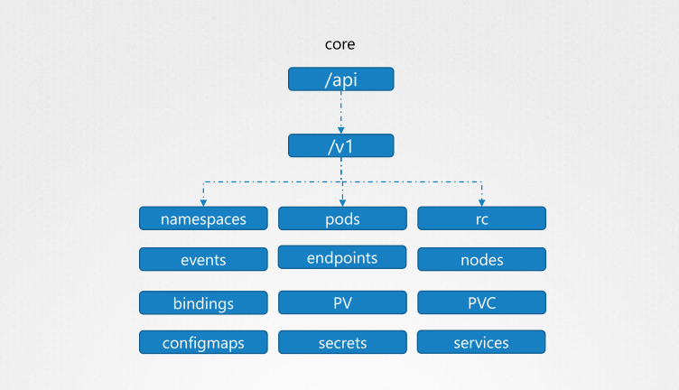
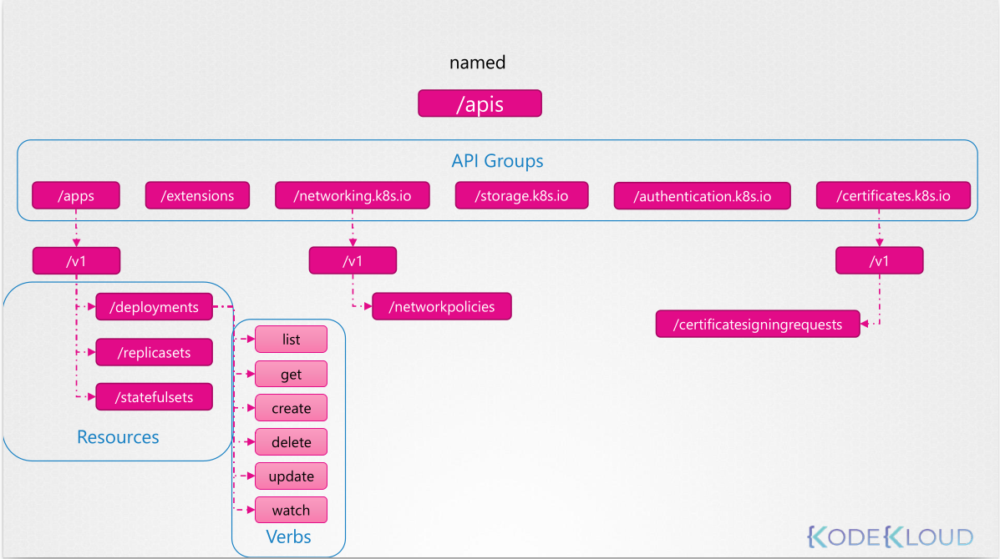

# Security

***Secure Kubernetes***
kube-apiserver
Who can access? | What can they do?

Who can access? (Authentication)
❑ Files – Username and Passwords
❑ Files – Username and Tokens
❑ Certificates
❑ External Authentication providers - LDAP
❑ Service Accounts

What can they do?(Authorization)
❑ RBAC Authorization
❑ ABAC Authorization
❑ Node Authorization
❑ Webhook Mode

Accounts
1- User Accounts
2- Service Accounts

:heavy_check_mark:

For Service Accounts <span style="color:green"> Correct </span>

```sh
kubectl create serviceaccount sa1
Service Account sa1 Created
```

```sh
kubectl list serviceaccount
ServiceAccount
sa1
```

For User Accounts <span style="color:red"> Wrong </span>

```sh
kubectl create user user1
user1 Created
```

```sh
kubectl list users
Username
user1
user2
```

----
CERTIFICATE AUTHORITY (CA)
Generate Keys
```sh
openssl genrsa -out ca.key 2048

ca.key
```
Certificate Signing Request
```sh
openssl req -new -key ca.key -subj "/CN=KUBERNETES-CA" -out ca.csr

ca.csr
```

Sign Certificates
```sh
openssl x509 -req -in ca.csr -signkey ca.key -out ca.crt

ca.crt
```
----
ADMIN USER

Generate Keys
```sh
openssl genrsa -out admin.key 2048

admin.key
```

Certificate Signing Request
```sh
openssl req -new -key admin.key -subj "/CN=kube-admin" -out admin.csr "/CN=kube-admin/OU=system:masters" -out admin.csr

admin.csr
```
Sign Certificates
```sh
openssl x509 -req -in admin.csr –CA ca.crt -CAkey ca.key -out admin.crt

admin.crt
```

Client Certificates for Clients
```sh
curl https://kube-apiserver:6443/api/v1/pods \
--key admin.key --cert admin.crt
--cacert ca.crt
```
---
## API Groups

***Try this***

`curl https://kube-master:6443/version`

`curl https://kube-master:6443/api/v1/pods`

> /metrics /healthz /version /api /apis /logs 





curl http://localhost:6443 -k
curl http://localhost:6443/apis -k | grep “name”

## RBAC

Developer

`developer-role.yaml`
```yaml
apiVersion: rbac.authorization.k8s.io/v1
kind: Role
metadata:
  name: developer
rules:
  - apiGroups: [""]
    resources: ["pods"]
    verbs: ["list“, "get", “create“, “update“, “delete"]
  - apiGroups: [""]
    resources: [“ConfigMap"]
    verbs: [“create“]
```
```sh 
kubectl create -f developer-role.yaml
```

`devuser-developer-binding.yaml`
```yml
apiVersion: rbac.authorization.k8s.io/v1
kind: RoleBinding
metadata:
  name: devuser-developer-binding
subjects:
  - kind: User
  name: dev-user
  apiGroup: rbac.authorization.k8s.io
roleRef:
  kind: Role
  name: developer
  apiGroup: rbac.authorization.k8s.io
```
```sh
kubectl create -f devuser-developer-binding.yaml
```

### View RBAC
```sh
kubectl get roles
```

```sh
kubectl get rolebindings
```
```sh
kubectl describe role developer
```
```sh
kubectl describe rolebinding devuser-developer-binding
```

### Check Access

```sh
kubectl auth can-i create deployments
yes

```

```sh
kubectl auth can-i delete nodes
no
```

```sh
kubectl auth can-i create deployments --as dev-user
no
```
```sh
kubectl auth can-i create pods --as dev-user
yes
```
```sh
kubectl auth can-i create pods --as dev-user --namespace test
no
```

### Resource Names

`developer-role.yaml`

```yml
apiVersion: rbac.authorization.k8s.io/v1
kind: Role
metadata:
  name: developer
rules:
- apiGroups: [""]
  resources: ["pods"]
  verbs: ["get", “create“, “update“]
  resourceNames: [“blue“, “orange”]
```

## Cluster Roles
`cluster-admin-role.yaml`

```yml
apiVersion: rbac.authorization.k8s.io/v1
kind: ClusterRole
metadata:
  name: cluster-administrator
rules:
- apiGroups: [""]
  resources: [“nodes"]
  verbs: ["list“, "get", “create“, “delete"]
```
```sh
kubectl create -f cluster-admin-role.yaml
```

`cluster-admin-role-binding.yaml`

```yml
apiVersion: rbac.authorization.k8s.io/v1
kind: ClusterRoleBinding
metadata:
  name: cluster-admin-role-binding
subjects:
- kind: User
  name: cluster-admin
  apiGroup: rbac.authorization.k8s.io
roleRef:
  kind: ClusterRole
  name: cluster-administrator
  apiGroup: rbac.authorization.k8s.io
```

```sh
kubectl create –f cluster-admin-role-binding.yaml
```